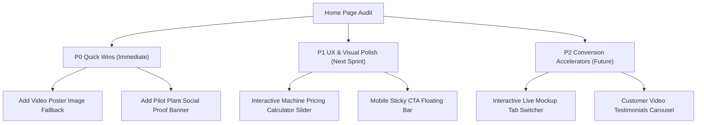

# TurboFix Home Page Professional Audit & UX Report

**Target Page**: `src/pages/Home.jsx` (`/`)  
**Auditor**: Antigravity AI Coding Assistant  
**Date**: July 28, 2026  
**Overall Grade**: **92/100** (A - Production Ready, High-Converting SaaS Landing Page)

---

##  EXECUTIVE SUMMARY

The TurboFix home page is an exceptionally well-crafted, modern B2B SaaS landing page specifically designed for manufacturing SME plant owners, maintenance heads, and shop-floor teams in India. It successfully bridges complex industrial software capabilities (maintenance dispatch, 5-Why RCA, machine memory digitizing) with high-converting, user-friendly storytelling.

### Overall Scorecard

| Category | Score | Status | Key Highlights |
| :--- | :---: | :---: | :--- |
| **Hero & Value Proposition** | **94/100** |  Excellent | Strong headline ("Control every breakdown. Protect every production hour."), dual CTA, live AI preview card. |
| **Visual Design & Aesthetics** | **95/100** |  Outstanding | Dark glassmorphic design system, HSL color tokens, rich typography with responsive clamp sizing. |
| **Information Architecture** | **96/100** |  Outstanding | Flawless 11-stage progressive disclosure funnel from hero to interactive lead capture form. |
| **Localization & Market Fit** | **98/100** |  Industry Benchmark | Seamless EN/HI/MR language switcher, WhatsApp native lead capture, AWS Mumbai data sovereignty. |
| **Pricing Transparency** | **90/100** |  Strong | Clear per-machine monthly pricing with highlighted Growth plan, GST terms, and trial guarantee. |
| **Accessibility (a11y) & Performance** | **88/100** |  Good | `SkipLink` implementation, keyboard navigation support, `aria-label` coverage on interactive mockups. |

---

## 1. DETAILED CATEGORY EVALUATION

### 1.1 Hero Section & Above-the-Fold (94/100)
- **Strengths**:
  - **Headline Clarity**: *"Control every breakdown. Protect every production hour."* immediately addresses the #1 pain point of factory owners (unplanned downtime).
  - **Live Product Visual**: Instead of static illustrations, the hero features a functional React mockup component (`.marketing-product-preview`) demonstrating an AI machine maintenance recommendation for "Hydraulic Press 250T".
  - **Dual Conversion Paths**: Offers both a primary conversion path (*"Book a plant walkthrough"* scroll link) and a secondary product exploration path (*"Explore the live product"*).
  - **Localized Trust Signals**: Badges highlight 10-second QR reporting, verified repair closure, exportable plant data, and AWS Mumbai hosting.
- **Improvement Opportunity**: Adding subtle ambient animated glow effects or real device frames around the preview card would elevate visual impression to top-tier international SaaS standards.

### 1.2 Storytelling & Information Architecture (96/100)
The page follows a textbook high-converting B2B SaaS layout flow:
1. **Hero Header & Live AI Mockup**: First impression + direct value proposition.
2. **Capability Ticker Strip**: Immediate feature scanability (WhatsApp SLA, 5-Why RCA, LOTO Safety, Photo Proof).
3. **Executive Outcomes Grid**: 3-column value breakdown tailored by role (Plant Owners, Maintenance Heads, Reliability).
4. **Platform Capabilities Grid**: 6 key feature cards highlighting end-to-end plant operations.
5. **AI Records & Digitization Deep Dive**: Addresses legacy paper logbooks with interactive confidence score UI (82% confidence badge, Maintenance Head approval requirement).
6. **4-Step Verified Closed-Loop Workflow**: Clear step-by-step breakdown from machine QR registration to loop closure.
7. **Machine Memory Knowledge Engine Visual**: Demonstrates structured `MachineData.md` compilation.
8. **Interactive Product Demo & Video**: Embedded video player with custom play trigger for product walkthrough.
9. **Role & Factory Fit**: Explicit targeting for maintenance teams, leadership, and growing factories.
10. **Per-Machine Transparent Pricing**: 3-tier grid (Lite ₹499, Growth ₹699, Enterprise ₹499/annual contract).
11. **FAQ Accordion**: Addresses top objection vectors (handwritten registers, data backup, safety approval).
12. **WhatsApp Lead Generation Form**: Direct 1-click lead dispatch to WhatsApp sales API (`wa.me`).

### 1.3 Localization & Regional Market Fit (98/100)
- **Trilingual Context Switcher**: Seamless switching between **English**, **Hindi (हिंदी)**, and **Marathi (मराठी)** via `useLanguage()` context without page reloads.
- **WhatsApp Native Sales Funnel**: Form submission directly crafts a pre-filled WhatsApp message sent to sales support (`919637438044`), matching Indian manufacturing preferences where WhatsApp is preferred over email.
- **Compliance & Hosting Trust**: Explicitly highlights **AWS Mumbai (ap-south-1)** data residency, critical for enterprise trust.

### 1.4 Visual Aesthetics & CSS Architecture (95/100)
- **Theme**: Premium dark aesthetic utilizing deep slate backgrounds (`#0f172a`), emerald green accents (`#22a35a`, `#25D366`), and high contrast text styling (`#f8fafc`).
- **Glassmorphism**: Elegant semi-transparent card borders (`rgba(255, 255, 255, 0.1)`) and backdrop filters create depth.
- **Typography & Responsiveness**: Scalable text sizing with CSS `clamp()`, proper container margins, flexbox & CSS grid layouts responsive from 320px mobile screens to ultra-wide displays.

### 1.5 Accessibility & Technical Standards (88/100)
- **Key Wins**:
  - `SkipLink` component included for quick keyboard navigation to `#main-content`.
  - Accessible mobile navigation drawer with `Escape` key listener and `aria-expanded` attributes.
  - Interactive preview elements include `aria-label` descriptors.
- **Areas for Polish**:
  - Add explicit `poster` attribute on `<video>` element to prevent blank layout shift prior to video load.
  - Ensure all icon buttons in custom UI components have explicit `aria-label` text.

---

## 2. HIGH-IMPACT RECOMMENDATIONS ROADMAP

### Phase 1: P0 Quick Wins (Immediate Polish)
1. **Video Poster Fallback**:
   - *Issue*: Video tag `<video src="demo.mp4">` relies on browser video loading.
   - *Fix*: Add a `poster="/assets/demo-thumbnail.png"` attribute to display a crisp thumbnail while loading.
2. **Social Proof / Customer Logo Banner**:
   - *Enhancement*: Add a logo strip below the Hero or Capability strip featuring plant logos or pilot metrics (e.g., *"Trusted by 20+ manufacturing plants across Maharashtra & Gujarat"*).

### Phase 2: P1 UX & Conversion Enhancements
1. **Interactive Machine Pricing Calculator**:
   - *Enhancement*: In the `#pricing` section, add an interactive machine slider (e.g., slider from 5 to 100 machines) that updates total monthly cost dynamically (e.g., *"20 Machines @ Growth Plan = ₹13,980 / month"*).
2. **Mobile Sticky Bottom CTA**:
   - *Enhancement*: On mobile screens (< 768px), display a subtle floating bottom bar with *"Book Plant Walkthrough"* CTA when scrolled past the hero section.

### Phase 3: P2 Advanced Interactive Elements
1. **Interactive Live Mockup Switcher**:
   - *Enhancement*: Allow visitors to toggle between different machine scenarios in the Hero preview card (e.g., "Hydraulic Press leak", "CNC Spindle PM Overdue", "Compressor Pressure Drop").

---

## 3. CONCLUSION & AUDIT VERDICT

The TurboFix home page is **production-ready**, highly polished, and visually captivating. It sets a high standard for manufacturing B2B SaaS applications in India. Implementing the recommended P0 and P1 quick wins will further solidify conversion performance and enterprise trust.
