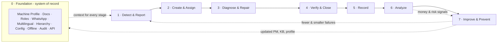

# TurboFix — Closed-Loop System & Zero-Burden Onboarding Plan

A systems-engineering plan for onboarding all 57 features as **one self-feeding closed loop** where every human action produces data as a by-product, and every system output removes future human work. Nothing in this plan asks any person to "feed the software."

---

## 0. The governing principle: burden absorption

> **A maintenance system fails at adoption the moment it asks a human to enter data for the system's benefit. TurboFix must do the opposite — absorb burden, never add it.**

Two engineering rules make the whole loop "no burden":

1. **Data is a by-product, never a task.** A person does their real job (report a fault, fix a machine, approve a spend) in the way they already would — by speaking, scanning, tapping once — and the record writes itself. No form is the *point* of any action.
2. **Every output must pay back its input.** Each analytic/automation the system produces (a reminder, a diagnosis, a summary) must remove more human effort than the loop consumed to generate it. If a feature only adds a screen to check, it fails the burden test.

Everything below is engineered against these two rules.

---

## 1. The closed loop (systems model)

Maintenance is a control system: **Inputs → Processes → Outputs → Feedback**. The feedback is what makes it *closed* — outputs re-enter as inputs and shrink the next cycle.



The loop **tightens over time**: better Prevent (stage 7) reduces the Detect load (stage 1); better Record/Analyze (5–6) makes Diagnose/Repair (3) faster. The system gets *lighter* on people the longer it runs — the opposite of a form-driven CMMS.

### The eight stages and every feature mapped

| Stage | Purpose (system function) | Features that live here |
|---|---|---|
| **0 · Foundation** | The permanent substrate every stage reads/writes | Machine Digital Profile · Document Library · Role-Based Access · Multilingual Support · WhatsApp Integration · Multi-Plant Hierarchy · Configurable Workflow · Offline Capability · Audit Trail · Data Export & API |
| **1 · Detect & Report** | Turn a shop-floor symptom into a signal | QR-Based Reporting · Voice/Photo/Video Reporting · AI Voice-to-Work-Order · Priority Classification |
| **2 · Create & Assign** | Turn a signal into an owned, tracked task | Automatic Work-Order Creation · Technician Assignment · Work-Order Status Tracking · Smart Notifications |
| **3 · Diagnose & Repair** | Fix it right, first time, with parts on hand | Technician Task Screen · AI Troubleshooting Assistant · Troubleshooting Knowledge Base · Spare-Parts Inventory · Spare-to-Work-Order Linking · Low-Stock Alerts · Purchase Request Workflow · Vendor & AMC Management |
| **4 · Verify & Close** | Stop temporary/incomplete repairs from closing | Voice-Based Job Closure · Photo Evidence at Closure · Supervisor Verification |
| **5 · Record** | Preserve the truth without extra typing | Machine Maintenance History · Downtime Tracking · Machine-Wise Maintenance Cost · AI Data-Quality Checks |
| **6 · Analyze** | Convert records into reliability & money insight | MTBF · MTTR · Machine Availability · PM Compliance · First-Time Fix Rate · Downtime Cost Calculation · Budget Tracking · Repeat Breakdown Detection · AI Failure Summary · Owner/Supervisor/Technician/Corporate Dashboards |
| **7 · Improve & Prevent** | Act on insight so the next cycle is smaller | Root-Cause Analysis · Corrective & Preventive Actions · PM Scheduler · PM Checklists · Automatic Reminders · Escalation Workflow · Repair-vs-Replacement Indicator · Shift Handover Summary · ERP Integration · IoT Integration |

*All 57 features are placed. None sits outside the loop — a feature that can't be tied to a stage doesn't belong in the product.*

---

## 2. The feedback loops that "close" the system

A checklist of features is not a closed loop. These five feedback arcs are what make TurboFix self-correcting. Each one is **fully automatic** — no human is asked to run the loop.

1. **Failure → Learning.** Repair closes → history + KB updated → next technician gets the proven fix in their Task Screen. *(Repeat Breakdown Detection → RCA → CAPA → Troubleshooting KB → faster First-Time Fix.)*
2. **Repeat failure → Prevention.** Same component fails twice → auto RCA flag → CAPA updates the **PM checklist** → the failure stops recurring. *(Repeat Detection → RCA → PM Checklist revision → MTBF up.)*
3. **PM ineffective → Method revision.** A machine fails soon after a completed PM → PM-effectiveness signal → PM frequency/checklist revised. *(PM Compliance + MTBF → PM Scheduler tuning.)*
4. **Spare drain → Supply/engineering review.** Unusual spare consumption → Low-Stock/consumption alert → Purchase Request or vendor/engineering review. *(Spare-to-WO Linking → consumption trend → Vendor/AMC accountability.)*
5. **Rising cost → Capital decision.** Machine-wise cost trends up while availability drops → Repair-vs-Replacement indicator → owner capital decision. *(Downtime Cost + Maintenance Cost + MTBF → Repair-vs-Replacement.)*

Each loop's output re-enters Foundation (updated profile/KB/PM) so the improvement is permanent, surviving staff turnover — the system remembers even when people leave.

---

## 3. Zero-burden onboarding, per role

The "no burden" promise is concrete: every role has a **burden budget** — the maximum effort the system may ever ask of them. Onboarding = giving each role exactly their slice, pre-filled, with one coach-mark, and nothing else.

| Role | Burden budget (hard limit) | What they do | What the system does *for* them (silent) |
|---|---|---|---|
| **Operator** | ≤ 30 sec, 0 typing | Scan QR, speak/photo the problem | AI Voice-to-WO writes the ticket, classifies priority, picks the machine — Detect & Create happen invisibly |
| **Technician** | 1 tap to start, ≤ 1 min to close, voice not typing | Start job, do the work, speak the result, snap a photo | Task Screen shows only what's needed; KB + AI suggest the fix; closure record, parts, labour, downtime all write themselves |
| **Supervisor** | Act on exceptions only | Approve/reject a closure; glance at one screen | Dashboard surfaces only open/overdue/PM-due/escalations; Shift Handover writes itself; Smart Notifications suppress everything non-actionable |
| **Maintenance Head** | Decisions, not data entry | Approve high-value spends; sign off RCA/CAPA | Repeat-failure & cost signals arrive pre-analyzed; approvals come by WhatsApp |
| **Storekeeper / Purchase** | React to alerts | Restock on alert; action purchase requests | Low-Stock Alerts + auto-drafted Purchase Requests from the work order |
| **Owner** | Read, ~2 min | Look at money & risk | Owner Dashboard converts the whole loop into ₹ lost, top loss machines, PM discipline, repair-vs-replace |
| **Corporate / IT Admin** | Setup once | Configure roles/hierarchy; connect ERP | Multi-Plant + Corporate Dashboard + Audit Trail + API run themselves after setup |

**The burden test (applied to every feature before it ships):** *Does this feature add a step to any role's day, or remove one?* If it adds one, it is redesigned until the step becomes a by-product of work the person already does — or it doesn't ship.

---

## 4. Onboarding as systems-engineering increments

Onboard the loop in increments that each **close a progressively larger control loop** and are independently verifiable. A customer never sees the whole feature set — they graduate as each loop proves itself. (Status reflects what is already live in production.)

| Increment | Loop it closes | Features | Onboarding burden added | Status |
|---|---|---|---|---|
| **I0 · Foundation** | System of record exists | Machine Profile, Docs, Roles, WhatsApp, Multilingual, Config | Owner: one machine + one QR (5 min) | **Live** (Profile §3.1, QR, Roles, WhatsApp, Multilingual) |
| **I1 · Capture loop** | Detect → Create → Assign → Track | QR/Voice/Photo/Video Reporting, AI Voice-to-WO, Priority, Auto WO, Assignment, Status Tracking, Smart Notifications | Operator: 30 sec scan+speak | **Live** (Work-Order lifecycle §3.4) |
| **I2 · Repair loop** | Diagnose → Repair → Verify → Close | Task Screen, AI Troubleshooting, KB, Voice/Photo Closure, Supervisor Verification | Technician: 1 tap + 1 voice note | **Mostly live** (Technician screen, voice/photo closure, verification) |
| **I3 · Prevent loop** | Analyze → PM → Reminder → Escalate | PM Scheduler, PM Checklists, Auto Reminders, Escalation, PM Compliance | Owner sets PM once; reminders are automatic | **Live** (PM Scheduler §3.5, Escalation) |
| **I4 · Parts & cost loop** | Repair ⇄ Spares ⇄ Purchase ⇄ Cost | Spare Inventory, Low-Stock, Spare-to-WO, Purchase Request, Vendor/AMC, Machine-Wise Cost, Downtime Cost, Budget | Storekeeper reacts to alerts only | **Partial** (parts, purchase_orders, downtime cost exist; linking/budget to build) |
| **I5 · Reliability-improvement loop** | Repeat → RCA → CAPA → PM revision | Repeat Breakdown Detection, RCA, CAPA, MTBF, MTTR, Availability, First-Time Fix, Maintenance History, Shift Handover, AI Failure Summary, AI Data-Quality | Zero — runs on data already captured | **Partial** (repeat detection, MTBF/MTTR views, history exist; RCA/CAPA/handover to build) |
| **I6 · Owner value loop** | Cost/risk → decision | Owner/Supervisor/Technician Dashboards, Repair-vs-Replacement | Owner reads; no entry | **Partial** (dashboards exist; RvR + cost depth to build) |
| **I7 · Enterprise & sensing** | Scale + auto-sensing | Multi-Plant Hierarchy, Corporate Dashboard, Audit Trail, ERP Integration, IoT, Offline, Data Export & API | IT setup once | **Planned** |

**Sequencing rule (SE):** never open an increment before the previous loop is *habit and verified*. An unclosed inner loop makes every outer loop noisy.

---

## 5. Burden-absorption matrix (the "no burden" guarantee)

Every feature, the role it could have burdened, and how the design removes that burden instead. This is the proof that no feature adds work.

| Feature | Could burden… | How the burden is absorbed |
|---|---|---|
| Machine Digital Profile | Owner (data entry) | Filled progressively; only name+location required; rest added as used |
| QR-Based Reporting | Operator | Replaces "find the right person"; scan auto-selects the machine |
| Voice/Photo/Video Reporting | Operator | Replaces typing entirely; speech *is* the input |
| AI Voice-to-Work-Order | Operator | AI drafts the structured ticket; operator only confirms |
| Automatic Work-Order Creation | Everyone | No one "creates" a ticket — it's a by-product of reporting |
| Technician Assignment | Supervisor | Auto-assigns the machine's technician; no dispatch call |
| Priority Classification | Reporter | AI suggests priority from the symptom |
| Work-Order Status Tracking | Supervisor | Status advances from actions already taken; nothing to update manually |
| PM Scheduler | Owner | Set once; recurs automatically |
| PM Checklists | Technician | Standard steps pre-listed; tap Done, don't write |
| Automatic Reminders | Supervisor | System chases the task; no manual follow-up |
| Escalation Workflow | Everyone | Delays move themselves up the chain; no one polices the clock |
| Technician Task Screen | Technician | Shows *only* the job — removes navigation burden |
| Voice-Based Job Closure | Technician | Speak the result; no closure paperwork |
| Photo Evidence at Closure | Technician/Auditor | One snap = proof; replaces written justification |
| Supervisor Verification | Supervisor | One approve/reject; evidence pre-attached |
| Machine Maintenance History | Everyone | Accumulates automatically from closed jobs |
| Repeat Breakdown Detection | Maintenance Head | System watches the pattern; no manual trend-hunting |
| Root-Cause Analysis | Engineer | Templated; history pre-loaded as evidence |
| Corrective & Preventive Actions | Head | RCA output becomes a tracked action automatically |
| Spare-Parts Inventory | Storekeeper | Counts adjust as spares are issued to work orders |
| Low-Stock Alerts | Storekeeper | System warns before stockout; no manual checking |
| Spare-to-Work-Order Linking | Technician | Selected from the job; drives cost with no extra entry |
| Purchase Request Workflow | Technician/Purchase | Raised from the work order, pre-filled |
| Vendor & AMC Management | Head | Contract/expiry tracked; warranty/AMC surfaced on the profile |
| Document Library | Technician | Manuals sit on the machine's QR page; no searching |
| Troubleshooting Knowledge Base | Junior technician | Prior fixes surface automatically; no asking seniors |
| Shift Handover Summary | Supervisor | Auto-compiled at shift end; no handover writing |
| Smart Notifications | Everyone | Only actionable alerts + a daily digest; kills alert fatigue |
| Owner Dashboard | Owner | Converts the loop to ₹; no report requests |
| Supervisor Dashboard | Supervisor | One action-focused screen |
| Technician Dashboard | Technician | Just my jobs, by priority |
| MTBF / MTTR / Availability | Management | Computed from timestamps already captured |
| PM Compliance | Management | Computed from PM logs; no tallying |
| First-Time Fix Rate | Head | Derived from reopen data; no scoring effort |
| Downtime Tracking | Everyone | Auto-computed from work-started → closed |
| Downtime Cost Calculation | Owner | Downtime × configured rate; labelled estimate |
| Machine-Wise Maintenance Cost | Finance | Aggregated from linked spares/labour/vendor |
| Budget Tracking | Finance | Actuals accumulate automatically vs plan |
| Repair-vs-Replacement Indicator | Owner | System flags uneconomic machines; decision stays human |
| AI Troubleshooting Assistant | Technician | Suggests causes; technician verifies |
| AI Failure Summary | Management | Turns data into a short brief; no manual reporting |
| AI Data-Quality Checks | Everyone | System finds gaps; no manual auditing |
| Multilingual Support | Operator | Their own language; removes the literacy barrier |
| WhatsApp Integration | Everyone | A channel they already use; zero new-app burden |
| Role-Based Access | Everyone | Each sees only their slice — removes cognitive load |
| Audit Trail | Auditor/IT | Writes itself on every change |
| Multi-Plant Hierarchy | Corporate | One-time setup; then automatic |
| Corporate Dashboard | Corporate | Cross-plant compare, computed |
| ERP Integration | Purchase/Finance | Removes duplicate data entry |
| IoT Integration | Everyone | Machine reports its own condition — the ultimate zero-burden sensor |
| Offline Capability | Operator/Technician | Captures offline, syncs later; weak network isn't their problem |
| Data Export & API | IT | Self-serve; no lock-in |
| Configurable Workflow | Admin | Set thresholds once; the loop adapts without a rebuild |

*No row adds a net step. Any future feature must earn a row here before it ships.*

---

## 6. Verification & validation (systems engineering)

Each closed loop has an explicit test, and each has a **burden test**. A loop isn't "onboarded" until both pass.

| Loop | Functional test | Burden test (must also pass) |
|---|---|---|
| Capture (I1) | A spoken report becomes a correct, assigned, tracked work order | Operator spent ≤ 30 sec and typed nothing |
| Repair (I2) | Closure with evidence is durable in the DB and verified before closing | Technician tapped once to start, spoke to close |
| Prevent (I3) | A due PM auto-reminds, escalates if overdue, and updates compliance | Owner did nothing after the initial one-time setup |
| Parts & cost (I4) | Issuing a spare updates stock, links to the WO, and rolls into machine cost | Storekeeper only reacted to an alert |
| Improvement (I5) | A repeat failure triggers RCA → CAPA → PM checklist change | No human ran the analysis manually |
| Owner value (I6) | Downtime + cost + reliability render as a decision-ready dashboard | Owner requested no report; just read |

**Success criteria for the whole system (validation):** >90% of breakdowns and PM captured; technicians update work without paperwork; owners see live downtime and ₹ loss; repeat failures trigger action; history survives staff turnover; every completed action updates a KPI — **and no role reports the system as extra work.**

---

## 7. Traceability (INCOSE)

Each feature traces cleanly from a stakeholder need to a measurable outcome, so nothing is built without a reason and nothing is onboarded without a way to prove it:

```
Stakeholder Need → Loop Stage (§1) → Feature → Feedback Arc (§2) → KPI/Outcome → V&V Test (§6)
```

Example: *Owner needs to stop losing money to a bad machine* → Analyze/Improve → Repeat Detection + Machine-Wise Cost + Repair-vs-Replacement → feedback arc 5 → "top loss machines" KPI → I6 functional + burden test.

---

## 8. What this means for the current build

Three inner loops are already live in production (**I0 Foundation, I1 Capture, I3 Prevent**, with **I2 Repair** mostly done). The highest-leverage next increments, in order:

1. **Finish I2/I4** — Spare-to-WO linking + machine-wise cost (closes the money side of the repair loop; low burden — data already flows).
2. **I5 Improvement loop** — Repeat → RCA → CAPA → PM revision (turns captured history into permanent reliability gains; **zero new burden**, runs on existing data — the highest ROI increment).
3. **I6 Owner value** — Repair-vs-Replacement + cost depth on the Owner Dashboard (the renewal/expansion trigger).

Each ships with its functional **and** burden test, on a branch, deployed the same way as the last three slices.

---

*Prepared for TurboFix · maps all 57 features into one self-feeding closed loop with a per-feature zero-burden guarantee.*
